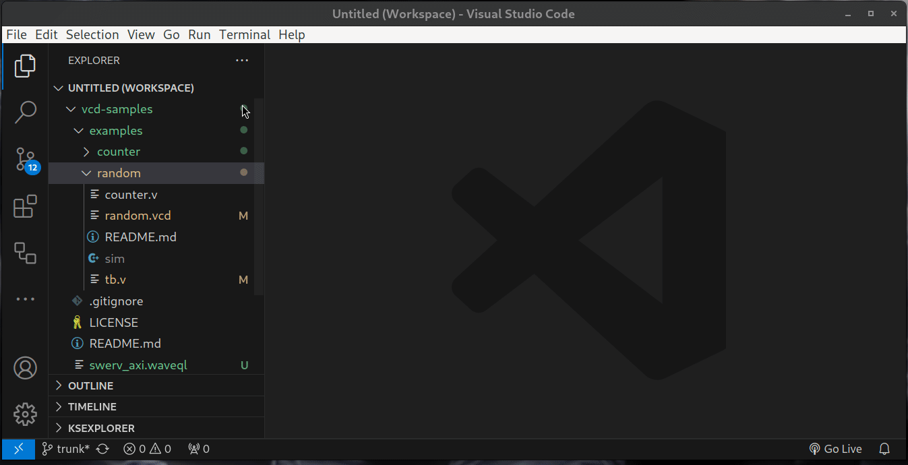

VCD viewer for Visual Studio Code

[VCDrom extension](https://marketplace.visualstudio.com/items?itemName=drom.vcdrom) provides ability to view VCD (Value Change Dump) files in VS code.

## Quck Start

* Create WaveQL file `my.waveql`
* Open WaveQL file with double-click
* Right click on VCD file `random.vcd`
* from context menu select `VCD -> VCDrom`
* Edit WaveQL file by adding signals
* Save WaveQL file for futher use

